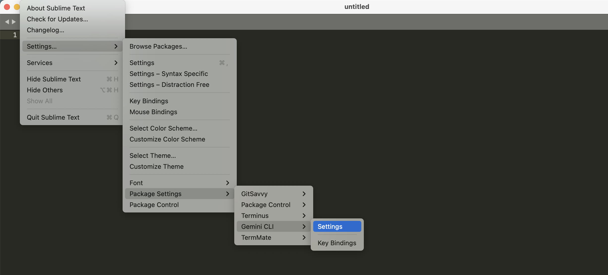

# Authentication

You must authenticate before the Gemini agent can process your requests. The plugin supports three ways to configure authentication.

## Terminal Authentication (Recommended)

This is the most straightforward method for individual users. Run the `gemini` command in your system terminal:

```bash
gemini
```

Once inside the Gemini prompt, type `/auth` and follow the instructions to log in with your Google account. This uses OAuth to securely store your credentials on your local machine.

## API Key

If you prefer using a static API key:
1. Obtain an API key from [Google AI Studio](https://aistudio.google.com/).
2. In Sublime Text, go to `Preferences -> Package Settings -> GeminiCLI -> Settings`.
3. Add your key to the configuration:
   ```json
   {
       "api_key": "YOUR_GEMINI_API_KEY"
   }
   ```



## Google Vertex AI (Enterprise)

For enterprise users on Google Cloud Vertex AI, you can configure your project details in the `env` section of your settings:

1. Ensure you have authenticated via the Google Cloud CLI: `gcloud auth application-default login`.

```
gcloud auth application-default login
```
2. Update your `GeminiCLI.sublime-settings`:
   ```json
   {
       "env": {
           "GOOGLE_CLOUD_PROJECT": "your-project-id",
           "GOOGLE_CLOUD_LOCATION": "us-central1"
       }
   }
   ```
3. Make sure your Google Cloud project has the Vertex AI API enabled.
