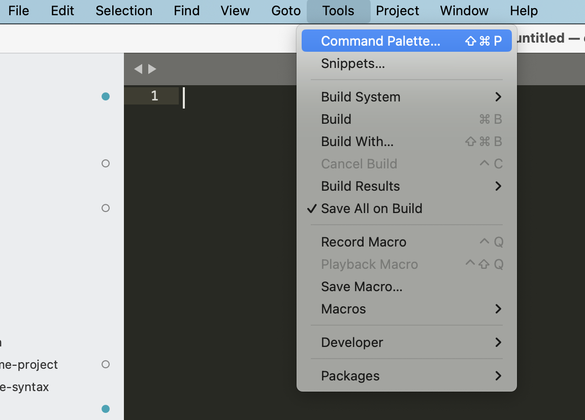
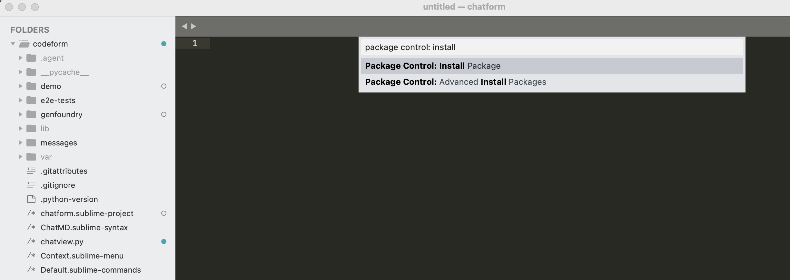
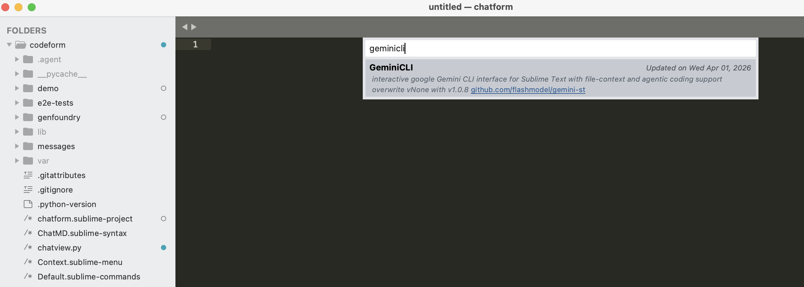

# Installation

To use this tool, you must install both the **Gemini CLI tool** and the **Sublime Text package**.

## Install Gemini CLI

### System Requirements
Before installing, ensure your system meets the minimum requirements:
- **Operating System:** macOS 15+, Windows 11, or Ubuntu 20.04+
- **Runtime:** Node.js 20.0.0+

### Installation Methods

**Requirement:** gemini-cli version `0.34.0` or higher is required.

#### Global Installation (Recommended)
You can install the CLI globally using your preferred package manager:

*   **via npm:**
    ```bash
    npm install -g @google/gemini-cli
    ```
*   **via Homebrew (macOS/Linux):**
    ```bash
    brew install gemini-cli
    ```
*   **via MacPorts (macOS):**
    ```bash
    sudo port install gemini-cli
    ```

## Install GeminiCLI in Sublime Text

[Via Package Control](https://packagecontrol.io/packages/GeminiCLI) (Recommended)



The easiest way to install Gemini SublimeText is through **Package Control**:
1. Open the command palette (`Cmd+Shift+P` on macOS, `Ctrl+Shift+P` on Windows/Linux).
2. Type `Package Control: Install Package` and press `Enter`.
3. Search for `GeminiCLI` and press `Enter`.





## Configuration

If the command line tool is installed in a non-standard path, or you wish to use a specific `gemini` version, you can manually set the path in `Preferences -> Package Settings -> GeminiCLI -> Settings`.

Example `gemini_command` paths:
- Windows: `"C:/Users/myname/AppData/Roaming/npm/gemini.cmd"`
- macOS/Linux: `"/usr/local/bin/gemini"`
