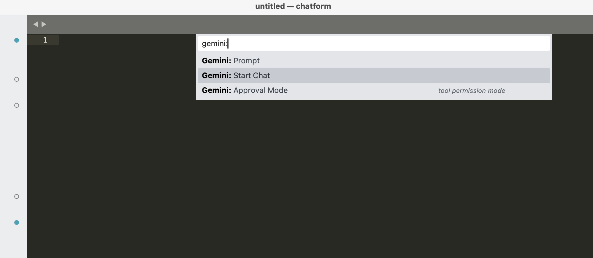
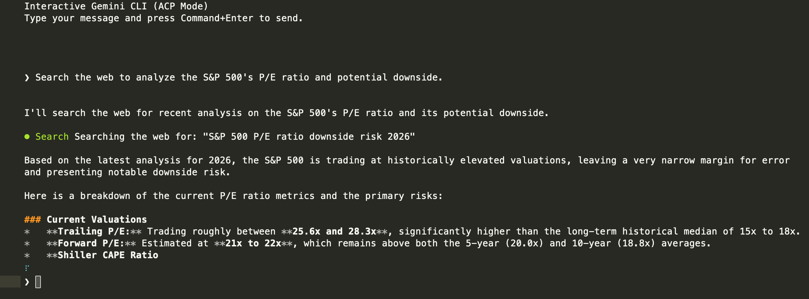

# Quickstart

Ready to start your first interaction with Gemini? Follow these steps to get up and running in minutes.

## Start your first Chat

1. Open the Command Palette (`Cmd+Shift+P` on macOS, `Ctrl+Shift+P` on Windows/Linux).
2. Search for **`Gemini: Start Chat`** and press `Enter`.
3. A new chat view will open with a `gemini-chat` tab.

## Send a Message

1. Type a question or instruction at the bottom of the view prefix with `❯ `.
   - Example: *"Explain the structure of the current project."*
2. Press `Ctrl+Enter` (macOS: `Cmd+Enter`) to send.
3. Gemini will begin "thinking" and eventually respond.

## Interact with Files

Try mentioning a file to give Gemini context:
1. Type: *"What does this file do? @index.md"*
2. The plugin will automatically detect `@index.md` and include its content in the request.

## Grant Permissions

If Gemini needs to perform an action (like reading a file it wasn't given, or listing a directory), you will see a permission prompt.
- Click **Allow** (or press the corresponding key) to let it proceed.
- Click **Deny** if you want to block the action.

## Review and Apply Changes

If you ask Gemini to modify code, it will present a **diff**.
- Review the proposed changes.
- Click **Apply** to write the changes to your file.
